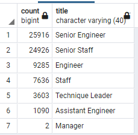
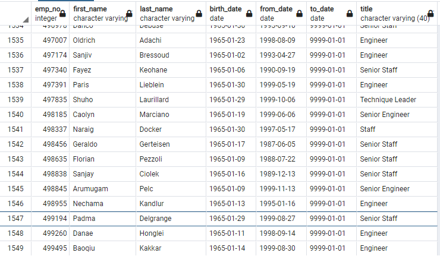

# Pewlett Hackard Analysis

## Project Overview

### Purpose
Pewlett Hackard has reached out to request an analysis done on the amount of employees the have coming up on retirement. For this analysis we will answer the following questions.
- How many employees are up for retirement?
- What titles will need to be replaced?
- What employees are eligible for the new mentorship program?

### Data
The data used in this analysis consist of 6 csv files: [departments](Quaries/Data/departments.csv), [employees](Quaries/Data/employees.csv), [department managers](Quaries/Data/dept_manager.csv), [department employees](Quaries/Data/dept_emp.csv), [salary](Quaries/Data/salaries.csv), and [titles](Quaries/Data/titles.csv). The data includes current and past employees in the mix. Employees are split up across 9 departments within the company.

## Analysis

### Methodology

For this analysis we used PGadmin to pull the CSV tables into an SQL Database. From there we used SQL to join and filter the data how we needed to develop results. All results were exported out as a csv file that can be found in the data folder. The code for this analysis can be reviewed [here](Quaries/Employee_Database_Challenge.sql).

## Results

Looking at the table above we can easily tell how many people are expected to retire and what roles will need to be replaced. By adding up the amount of employees under each title we can see that 72,458 are expected to retire from the company in the near future. Of the roles within the company, senior engineers will see the largest amount of retirees followed by senior staff. The rest of the titles are pretty far behind those two in terms of the amount of people that are expected to leave. The engineering group in total is expected to lose 36,291 total people. Only 2 managers are expected to retire soon from the company. From this table we can take away.
- 72,458 people are expected to retire.
- Senior engineers are expecting the largest number of open positions
- only 2 managers will need to be replaced soon in the company

To facilitate all the people planning to retire Pewlett Hackard wants to start up a mentor program for the employees closest to retirement to train the younger staff to help fill the positions after they leave. Looking at a snippet of the [mentor table](Quaries/Data/mentorship_eligibilty.csv) we can see that of the 75,458 employees expected to retire soon, 1,549 employees are ready to take up a mentor roll within the company. Al;l of these employees were born in 1965 meaning they are right in the cusp of retirement. By looking through the list Pewlett Hackard can easily develop the mentor program and assign it to the employees that will need it the most to fill their position.

- Of the 75,458 employees set to retire, 1,549 are eligible to be mentors.

### Summary

With the results above we can address the situation with what Pewlett Hackard dubs The “Silver Tsunami”. With the title count table we have easily concluded that 75,458 employees will be replaced within the next 4 years. That is a large amount of employees that will need to be replaced and will require a delicate system. In order to come up with an accurate game plan Pewlett Hackard can look at the [Unique Title](Quaries/Data/unique_titles.csv) table. With this table they can find out who needs to be replaced,, in what role, and when they will be expected to leave.

The mentor program Pewlette Hackard wants to put in place only has 1549 people ready to fill its roster. With that being only 2% of the total number of retirees, they do not have enough people chosen to fill the demand that is needed. The company needs to go back through the list of employees and change their requirements. With the [Retirement Titles](Quaries/Data/retirment_titles.csv) table they can review what positions an employee has previously filled within the company. Using this info they can not only assign mentors current positions that they need to train but also past positions they may have worked and retain knowledge of. This analysis will allow less busy mentors like the people in management to flex and help out fields like senior engineers where there is a lot of demand.

